# TB Surveillance - Notifications and Outcomes { #tb-agg-no-design }

## System Design Guide - Version 3.0.0

## Introduction

This document describes the system design for TB programmes to integrate routine aggregate reporting into the HMIS. Depending on the local context, this data may be populated by paper-based reporting or by aggregating data from electronic individual-level systems such as DHIS2 Tracker or other tools. In particular, the TB aggregate version 3.0.0 aims to outline the updates made in definitions and data entry forms as presented in the [TB surveillance guidance (2024) available online].(https://www.who.int/publications/i/item/9789240075290)

## Overview

<table>
  <tr>
   <td><strong>Dataset Name</strong>
   </td>
   <td><strong>Periodicity</strong>
   </td>
   <td><strong>Description</strong>
   </td>
  </tr>
  <tr>
   <td><strong>TB - Notifications</strong>
   </td>
   <td>Monthly
   </td>
   <td>Reporting on core quarterly indicators for new episodes, re-registered, and recurrent cases.
   </td>
  </tr>
  <tr>
   <td><strong>TB - Notifications</strong>
   </td>
   <td>Yearly
   </td>
   <td>Reporting on additional indicators for RR-TB, MDR, pre-XDR, and XDR testing and confirmations.
   </td>
  </tr>
  <tr>
   <td><strong>TB - Outcomes</strong>
   </td>
   <td>Monthly
   </td>
   <td>Reporting on cohort and outcomes of RIF-susceptible cases on short regimens.
   </td>
  </tr>
  <tr>
   <td><strong>TB - Outcomes</strong>
   </td>
   <td>Yearly
   </td>
   <td>Reporting on cohort and outcomes of RIF-susceptible and RR-TB cases on short and long regimens. 
   </td>
  </tr>
</table>

## Datasets Structure and Design

**> **💡 NOTE:**** Upon the implementation and use of the updated framework of metadata present in version 2.0.0 implementers should pay particular attention to data and content consistency, as the indicators belonging to the previous metadata version might not align perfectly with the current standards or definitions; and interpretation challenges, as guidelines and methodologies evolve where older indicators might not accurately reflect the current context or priorities, creating grounds for potential misinterpretation of data and long-term limitation of content relevance.

The **major update** in DHIS2 **version 3.0.0** is the transition from **custom datasets** to **flat datasets**. This change was implemented based on valuable feedback from country-level implementations and careful consideration of long-term maintenance requirements.

The shift to flat datasets offers several key advantages:

* **Simplified Indicator Mapping** – Countries can more easily align their local indicators with the standardized toolkit content, ensuring better integration with national reporting systems.
* **Improved Data Manipulation & Contextualization** – The new structure allows for more flexible adaptation of the dataset to meet specific country needs while maintaining consistency with global standards.
* **Easier Toolkit Maintenance & Updates** – With a more streamlined dataset design, future updates and enhancements to the toolkit will be easier to implement, reducing the burden on national health teams and system administrators.

By adopting this **flat dataset structure**, the DHIS2 TB aggregate toolkit enhances **data consistency, usability, and long-term sustainability**, ensuring that TB program data remains **actionable, accessible, and adaptable** across diverse healthcare settings.

#### TB - Case notification - Quarterly

The TB aggregate version 3.0.0 metadata mirrors some key changes in terminology and definitions outlined in the new guidance and already present in the second version of the DHIS2 toolkit.

* The **old “Relapses” **are now called** “Recurrent” cases** - This change ensures alignment with the case definition for people with TB commonly used in TB clinical trials.
* The **old “Retreatments”** are now called **“Re-registered for treatment“** - this is a simplified and more accurate description for people who start a new TB treatment regimen (following either treatment failure or LTFU), or for whom the outcome of a previous treatment is undocumented/unknown.
* The **old “New or relapse cases”** are now called **“New episodes of TB"** - this is a simplified description of people newly diagnosed with TB.

The **quarterly dataset** includes **core indicators** that require more frequent reporting compared to those in the **yearly dataset** for notifications. Certain data points have been specifically designed for the quarterly dataset, as they can be aggregated to generate annual reports when needed. The **primary objective** of this approach is to **alleviate reporting demands** and simplify data management for implementers. By structuring reporting into manageable quarterly submissions, the system reduces the burden of extensive annual data entry while maintaining the ability to generate yearly summaries efficiently.

For local implementations considering parallel **annual reporting alongside quarterly reporting** (e.g., for **HIV-positive TB patients** or specific **notified cases by treatment history**), it is essential to ensure that **data elements (DEs) are clearly separated** into **quarterly and yearly DEs**. This prevents **double reporting** and avoids duplication of values, which could occur when quarterly data is aggregated into an annual report while also being manually entered in a separate yearly dataset.

Proper structuring of DEs will ensure **data accuracy, consistency, and streamlined reporting** across different reporting cycles.

###### TB cases by site, method, and previous treatment history

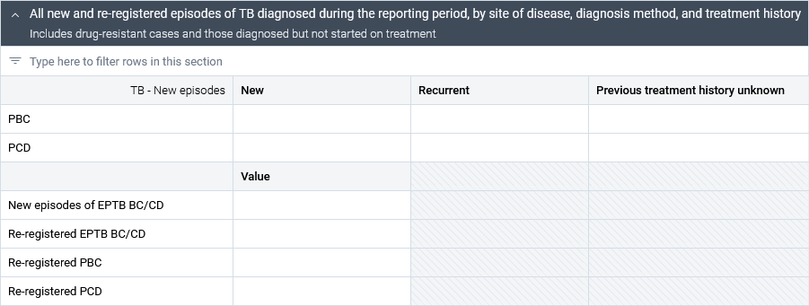

For both **Pulmonary Bacteriologically Confirmed (PBC)** and **Pulmonary Clinically Diagnosed (PCD)** TB cases, **quarterly reporting** is sufficient to capture new episodes—specifically, **never-treated cases**, **recurrent cases**, and those with **unknown treatment history**.

This section also covers re-registered PBC, re-registered PBC, and new and re-registered extrapulmonary TB (EPTB). Unlike new PBC and new PCD, these data elements are not reported disaggregated by treatment history.

###### TB Cases by Age and Sex

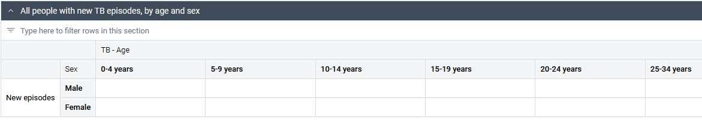

The **disaggregation of new TB episodes** (previously classified as "new" and "relapse" cases) by **age and sex** is included only in the **quarterly dataset**, as the system allows for **yearly analysis** of these data points without requiring additional manual input at the annual level.

The **age disaggregation** remains unchanged from version **2.0.0**, following these categories: \
**0-4 years, 5-9 years, 10-14 years, 15-19 years, 20-24 years, 25-34 years, 35-44 years, 45-54 years, 55-64 years, 65+ years, and Unknown Age**. Compared to the older versions, in this and version 2.0.0, child, adolescent, and young adult age groups are further disaggregated into the 5-9, 10-14, 15-19, and 20-24 age groups in line with the general surveillance guidance, and recognizing the differences in risk factors among the adolescent and young adult age groups.

> 💡 **Tip:** The sum of the table should reflect the sum of the new episodes reported in the previous section.

**The sex disaggregation** has been shifted to the **row layout**, taking advantage of a new system feature that enhances data organization and visualization. This layout aligns with **WHO reporting guidance**, though implementers also have the option to **move Age disaggregation to the rows**, depending on programmatic preferences or reporting needs. 

> 💡 **Tip:** These configurations can be adjusted in the **Maintenance App** by navigating to: \
 **Dataset > Manage > [Select Dataset Section] > Pivot Options**.

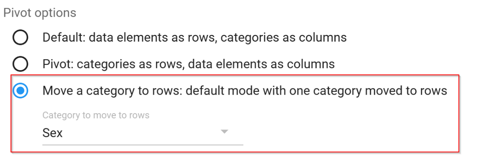

### HIV Testing and ART coverage

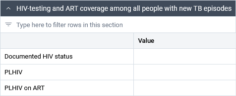

The section is only present in the quarterly dataset. The data points can be aggregated yearly for annual analyses. The new version no longer reports the DE "HIV-positive TB patients on cotrimoxazole preventive therapy CPT" as the DE “HIV-positive TB patients on antiretroviral therapy” fully captures the desired endpoint.

###### RIF Susceptibility Testing

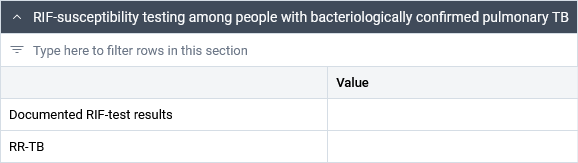

Rifampicin (RIF) susceptibility testing is not disaggregated in the quarterly dataset. 

**> ⚠️ **Important Note:** Other testing and laboratory-related information** has been **permanently moved** to the **TB - Laboratory dataset**. For instance, the **“Laboratory Diagnostic Activities”** section, which was included in **Version 1.5.0**, is no longer present in the current dataset. The DEs and corresponding indicators are currently present in the “TB - Laboratory” dataset. Implementers should carefully assess local workflows and capacities to determine whether laboratory reporting and notifications reporting should remain separate or be merged into a single dataset, ensuring alignment with national reporting structures and operational efficiency.

| Metadata                                                                      | Type         | UID         |

|-------------------------------------------------------------------------------|--------------|-------------|

| TB-LAB - Presumptive cases tested by any WRD                                  | Data element | N7LIAia2AWf |

| TB-LAB - Presumptive cases tested positive by any WRD                         | Data element | TiwOMtQvbLY |

| TB-LAB - Presumptive TB cases tested using a WHO-recommended rapid diagnostic | Indicator    | As2eOxgQM9H |

These are recommended for reporting and use in countries with case-based digital surveillance systems as well as additional indicators that are options to be considered in countries with case-based digital surveillance systems as listed in Table 4.7 and Table 4.9 of Chapter 4 of the guidelines. These data items, including also the DEs present in the “Bedaquiline and linezolid susceptibility testing among people with PBC RR-TB” section of the yearly notification dataset, could be collected through periodic surveys based on a random sample of patient records, instead of routine continuous surveillance.

###### Enrollment on treatment

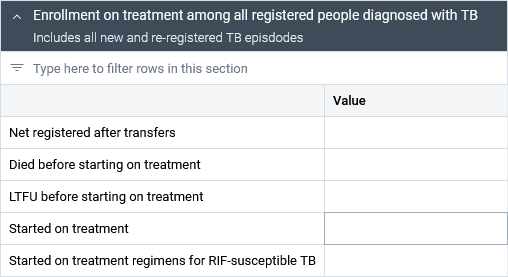

This section is designed to capture the **treatment** **initiation status** of TB cases (only the **new episodes)** that have been **registered in the system **at a given health facility, accounting for transfers. It should include individuals who **died** or were **lost to follow-up before treatment initiation**, and the number of individuals who **initiated any TB treatment **regimen.

The final data point in this section is intended to report **only RIF-susceptible TB cases who have started a treatment regimen**. As such, this group **is a nonmutually exclusive subgroup** of the broader **“Started on treatment”** data point, and should be interpreted accordingly during analysis.

#### TB - Case notification - Yearly

The **yearly dataset** expands on the information captured in the **quarterly dataset** with resistance testing information and treatment initiation. 

###### RIF susceptibility testing

Unlike the quarterly dataset that reported just the total aggregate number, the yearly dataset requests the users to provide the yearly information on RIF testing disaggregated by treatment history. To ensure the quality of the data, users should cross-check that the yearly aggregation of the quarterly values is equal to the values reported in the yearly dataset.

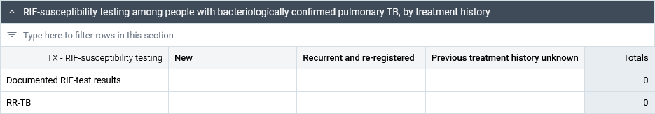

**> ⚠️ **Important Note:** **The section on new episodes by age and sex, and the one on HIV testing, are only reported within the quarterly framework. The outputs can be aggregated for yearly reporting within the system.

###### INH testing

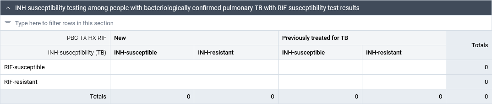

The section combines the history of TB and INH susceptibility with information on RIF-susceptible and RIF-resistant cases.

###### BDQ, LZD, FLQ Susceptibility Testing

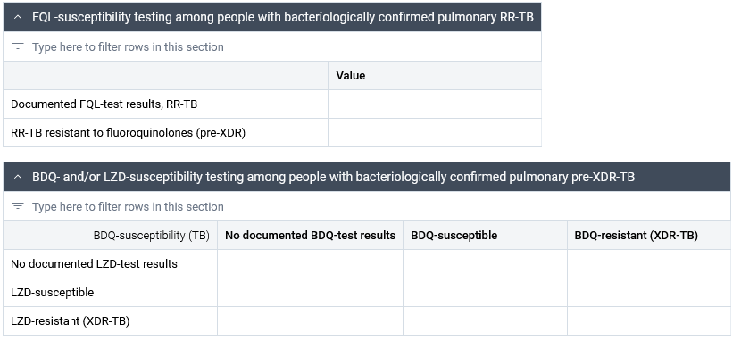

The tables are designed taking into consideration that, as of today, BDQ and LZD testing is not as widespread as other susceptibility tests. As the BDQ and LZD resistance monitoring becomes more available, the number of “No documented tests” should decrease, while the tested values of susceptibility and resistance for both drugs should increase.

###### Enrollment in Treatment and Started on Treatment

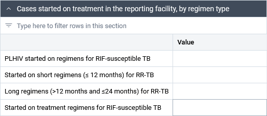

The final section of the dataset provides more granular information about the case type and the regimens of cases which were started on treatment.

## TB - Outcomes - Quarterly

The quarterly dataset reports the treatment cohort and treatment outcomes for RIF susceptible cases started on a short (=&lt; 12 months) treatment regimen one year before the current reporting year.

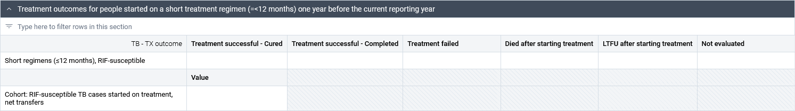

In version 2.0.0, this dataset included a tally structured by different types of TB cases (bacteriologically confirmed, clinical, re-treatments, HIV-positive patients). To further reduce the burden of data collection, cohorts and outcomes disaggregated by HIV status and method of confirmation have now been moved to the yearly dataset, simplifying regular reporting requirements.

Further, to align with the new guidance on TB surveillance, Version 3.0.0 no longer features the information on HIV status by the time of outcome. All TB patients should be tested at diagnosis and records should be updated when HIV results are available.

## TB - Outcomes - Yearly

In version 3.0.0, the yearly dataset for treatment outcomes now captures data separately for both short and long regimens and distinguishes between Rifampicin-susceptible and Rifampicin-resistant TB (RR-TB) cases. This adjustment follows the same principle of reducing the quarterly reporting burden, particularly benefiting countries still heavily dependent on paper-based surveillance systems and case registries.

> 📌 **Attention:**  When working with the new metadata for ongoing analysis, implementers should remember how the older framework was used locally. They need to think about the best ways to analyze past data, considering total numbers, previous reporting methods, and the differences between short and long regimens against an older framework that did not report the same type of information.

#### Cohorts after accounting for transfers

The first section of the dataset reports the active cohort (after accounting for transfers) of RIF susceptible TB cases for PLHIV (the patients with all HIV status are accounted for in the quarterly dataset and can be analyzed annually by aggregating quarterly values), and of rifampicin-resistant (RR-TB) cases (RR, MDR, pre-XDR. XDR) on short and long regimens. 

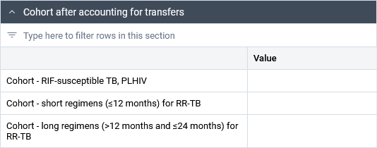

#### Treatment outcomes for people who started on short regimens

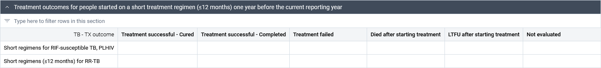

The section reports both RIF-susceptible PLHIV TB cases (those irrespective of HIV status were reported quarterly and can be aggregated) and RIF-resistant cases on short treatment (=&lt; 12 months)The outcomes reported for short regimens should be for those who started the treatment one year before the current reporting year. 

#### Treatment outcomes for people who started on long regimens

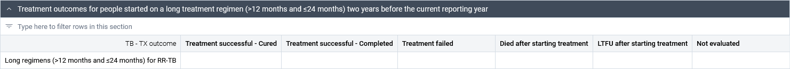

The section reports RIF-resistant cases (RR, MDR, pre-XDR, XDR) enrolled on a long (>= 12 months and =&lt; 24 months) treatment regimen. The outcomes reported for long regimens should be for those who started treatment two years before the current reporting year.

To minimise reporting burden, there is no longer a need to disaggregate treatment outcomes by both drug resistance status and HIV status for countries with aggregate systems (see Chapter 4 of TB surveillance guidance). However, this can still be considered in case-based digital systems for more detailed analyses.

#### Treatment outcomes for people with new episodes of RIF susceptible PTB on a short regimen

Lastly, the dataset reports pulmonary RIF susceptible TB cases by method of diagnosis - clinically diagnosed or bacteriologically confirmed - on a short treatment.

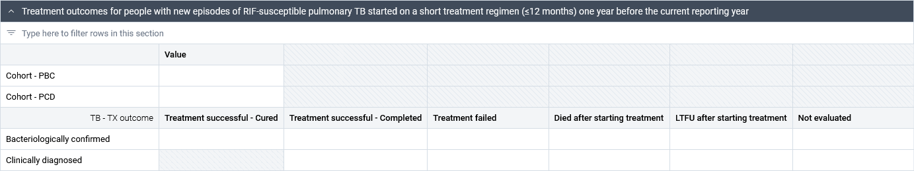

> 💡 **Tip:** The totals for the cohorts and outcomes should match the totals of the cohort and outcomes of the RIF susceptible cases reported regardless of their HIV status. 

## Validation Rules

This outcomes and notifications datasets come equipped with 22 validation rules to strengthen data quality across dataset sections, such as ***All new episode types == All people with new episodes by age/sex***. They can be executed during data entry, or in bulk through the DHIS2 data quality app. 

Two important design considerations:

* In recognition that there some inconsistencies may be natural when correcting quarterly data aggregated for annual reporting, all validation rules only examine internal consistency within a given dataset; no comparisons are made across datasets.
* Many reporting systems are paper-based, and inconsistent reports from facilities may be unavoidable. Validation rules are shown as warnings, allowing data to be reported even when internally inconsistent.

## Analytics and Dashboards

The DHIS2 TB toolkit comes with **8 predefined dashboards** with over 200 indicators, and 160 tables, charts, and maps to support programmatic monitoring and reporting. Among these, **two dashboards are specifically designed for quarterly and yearly reporting**, featuring **pivot tables** that present **core indicators** across different **disaggregations** (such as new episodes vs re-registered) and **reporting periods**. This setup streamlines routine reporting by consolidating key data into a single view, making it easier for users to analyze trends and track progress efficiently.

### Quarterly Report

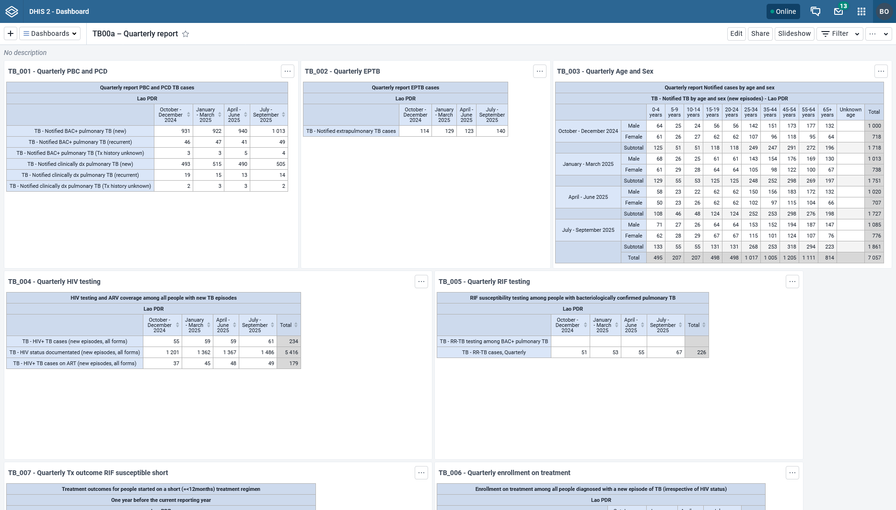

### Yearly Report

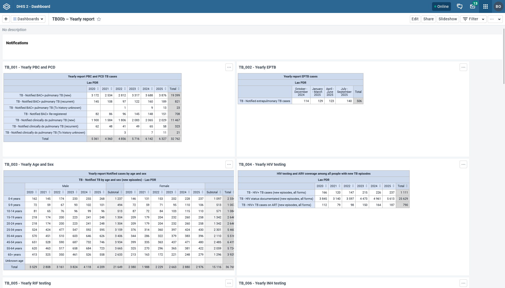

The subsequent dashboards are intended for routine monitoring and analysis of key trends across reporting units over time. Stylistically, it includes:

* Section dividers with definitions, to support flow of analysis
* Default legend sets for maps and charts
* Geography is user organisation unit x2, with maps showing the entire geographic extent
* Most visualizations are percentages, and are marked with (%) at the end of their names. Visualizations not depicting a percentage describe the unit on the y-axis label.
* Data value labels
* Relative periods (last quarter, last 4 quarters, last year or last 5 years)

These can all be adapted for local data analysis and reporting tasks.

### TB01 – Notifications (Quarterly)

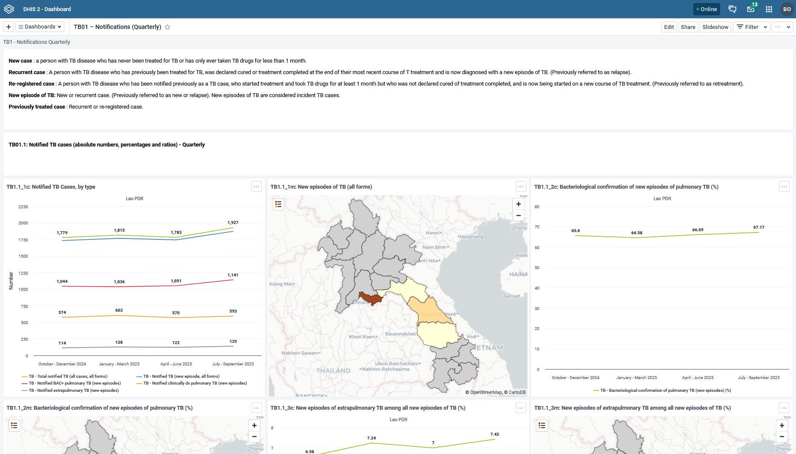

Sections:

* TB01.1: Notified TB cases (absolute numbers, percentages and ratios) - Quarterly
* TB01.2: Notified TB cases (rates per 100 000 population) - Quarterly
* TB01.3: HIV-associated TB

Since this dashboard shows coverage rates by population, some visualizations and maps require local adaptation by replacing placeholder data elements with national population data elements. The corresponding indicators, visualizations, and maps have a `[PLACEHOLDER]` in the name. 

### TB02 – Notifications (Annual)

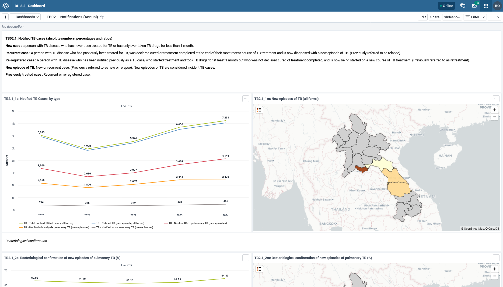

Sections:

* TB02.1: Notified TB cases (absolute numbers, percentages and ratios)
* TB02.2: Notified TB cases (rates per 100 000 population)
* TB02.3: HIV-associated TB

This dashboard also shows coverage rates by population; some visualizations and maps require adaptation by replacing local placeholder data elements with national population data elements. The corresponding indicators, visualizations, and maps have a `[PLACEHOLDER]` in the name.

The data elements prefixed with GEN for population have been included in the configuration to demonstrate how some calculations, such as ratio of cases aged 5-14 and 0-4 years old, could be calculated using 5-year population ranges, which are common in many HMIS. Visualizations showing notification rates based on TB age bands, such as** TB2.1_7c: New episodes of TB, by age (rate), **must match the age bands of available population reports.

### TB03 – Drug resistance testing and results (Quarterly)

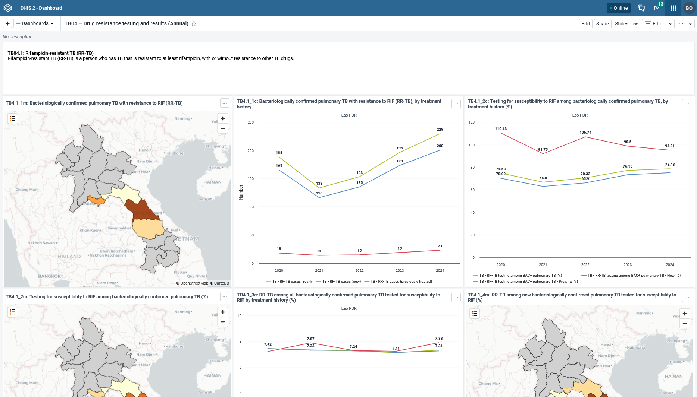

### TB04 – Drug resistance testing and results (Annual)

Sections:

* TB04.1: Rifampicin-resistant TB (RR-TB)
* TB04.2: Multidrug-resistant TB (MDR-TB)
* TB04.3: Isoniazid-resistant, rifampicin-susceptible TB (Hr-TB)
* TB04.4: Pre-extensively drug-resistant TB in RR-TB (pre-XDR-TB)
* TB04.5: Extensively drug-resistant TB in RR-TB (XDR-TB)

### TB05 – Outcomes (Quarterly)

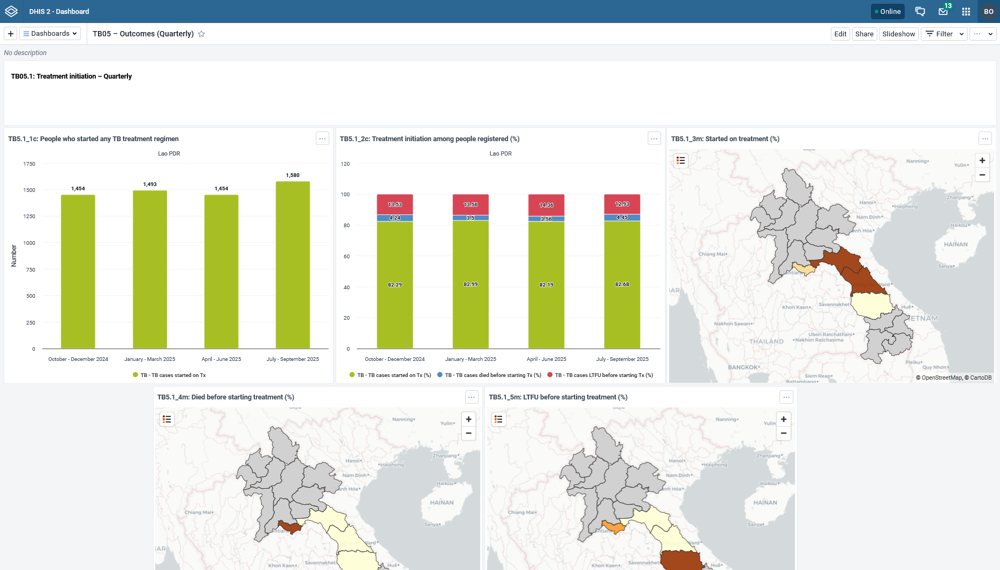

Sections:

* TB05.1: Treatment initiation – Quarterly
* TB05.2: Treatment outcomes - Quarterly

In the data entry forms, treatment outcomes are entered for cohorts who started treatment one year prior (for short regimens) or two years prior (for long regimens). 

Treatment and case outcome indicators match this shift through use of the periodOffset() function. Therefore, cohort indicator values correspond to the period when the cohort initiated treatment, *not *the period when the outcomes were reported.

As a consequence, some outcome visualizations will not have data for the most recent periods. As an example, TB5.2_2c: Regimens for RIF-susceptible TB: Treatment outcomes only shows the period this time 4 quarters prior, because the longest available setting for relative quarterly periods is the “last 4 quarters”, and this cohort started treatment exactly 4 quarters ago.

In order to show further periods, a system administrator can set this to *fixed *periods (e.g. 2024-2025), with the desired number of quarters, and re-shift the fixed periods forward every 1-2 years.

Outcome indicators using the periodOffset function on quarterly data elements are also notable because they specify the correct analysis period type in the indicator name (Quarterly or Annual). This function shifts the indicator value* x* number of periods back from the reporting period after aggregation; if analyzing a *quarterly *indicator at the *annual *level in Data Visualizer, the value will shift 4 *years *back, causing misinterpretation.

### TB06 – Outcomes (Annual)

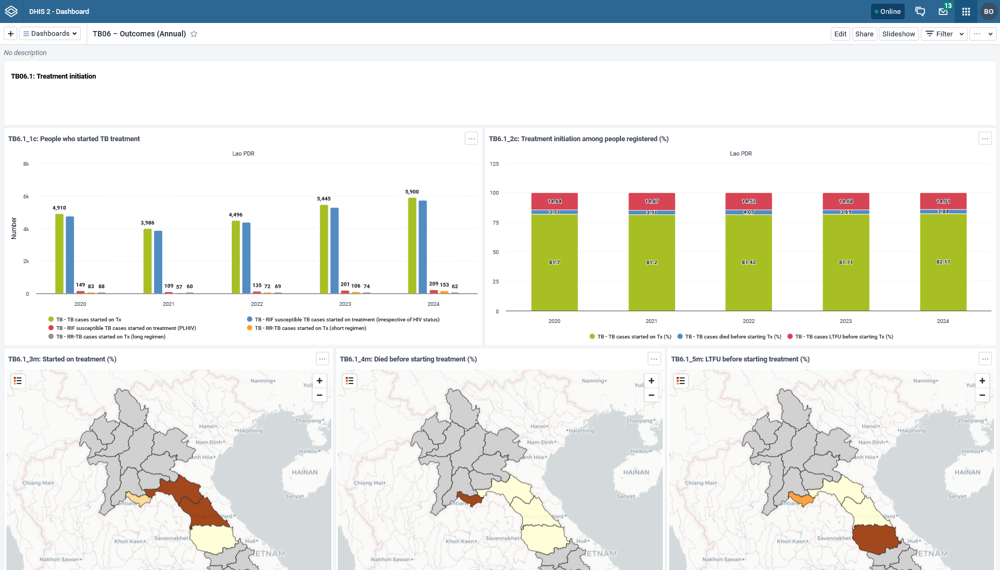

Sections:

* TB06.1: Treatment initiation
* TB06.2: Treatment outcomes

Similarly to quarterly outcomes, long regimens in this dashboard will not be shown for the last two years of data, as these cohorts did not yet complete treatment.

It is imperative for implementers and NTB Programs to collectively comprehend the previously utilized reporting metadata and adapt to the new reporting framework, structured around regimens and drug susceptibility. A key example to highlight the importance of this mapping is the potential to analyze outcomes of XDR cases (old framework) by incorporating the outcomes of RIF and FQ resistant cases (new framework) into the same indicators- local implementations will dictate the feasibility of this adjustment and whether this new indicator for continuity would analyze all cases or specific regimens. This adaptation is crucial for establishing connections and sustaining analytical insights. It's important to note that achieving complete alignment between the old and new frameworks might pose challenges in certain contexts, influenced by the implementation choices made during the initial rollout of the older TB aggregate DHIS2 toolkit.

